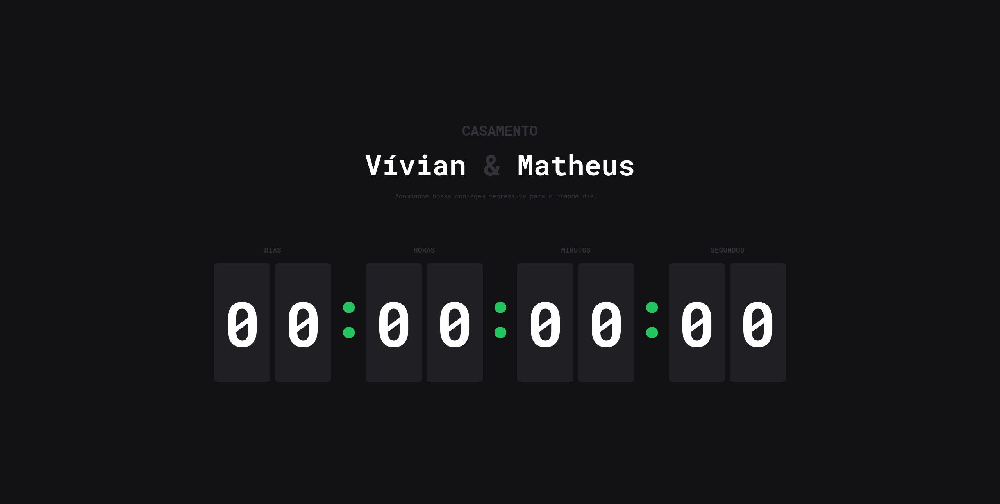

<h1 align="center"> Coming soon </h1>

 Projeto desenvolvido para meu casamento, para mostrar quanto tempo falta para o dia

  <a href="#-tecnologias">Tecnologias</a>&nbsp;&nbsp;&nbsp;|&nbsp;&nbsp;&nbsp;
  <a href="#-projeto">Projeto</a>&nbsp;&nbsp;&nbsp;|&nbsp;&nbsp;&nbsp;
  <a href="#memo-licença">Licença</a>

  

 

  

## 🚀 Tecnologias

Esse projeto foi desenvolvido com as seguintes tecnologias:

- Next
- React
- TypeScript
- Tailwind
- Git
- Github

## 💻 Projeto

Um projeto de countdown negativo, uma contagem regressiva até o dia definido.

## :memo: Licença

Esse projeto está sob a licença MIT.

---

by Matheus Ramalho - [matheusramalho.dev](matheusramalho.dev)
